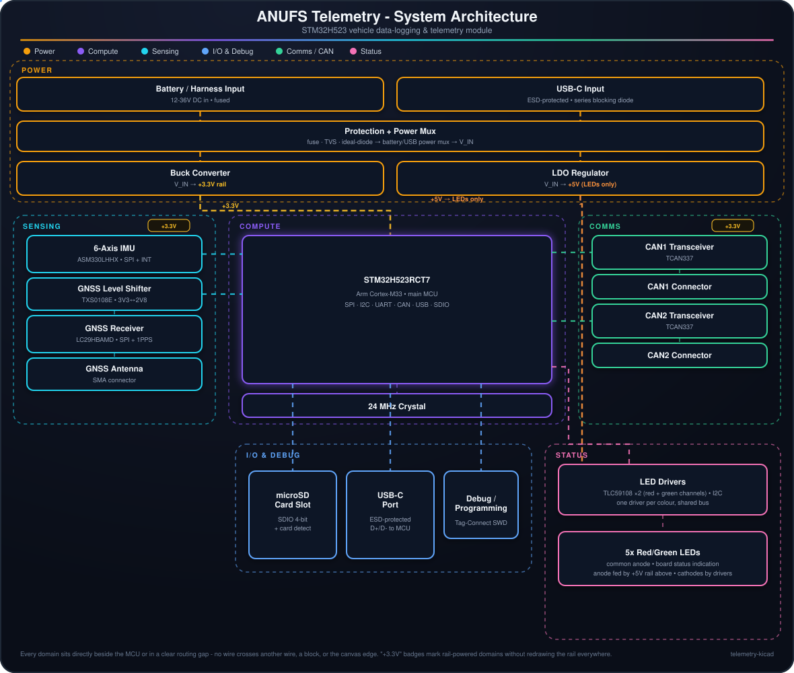

# ANUFS Telemetry

  

STM32H5-based data-logging and telemetry module for the ANUFS vehicle. It sits on two of the car's CAN buses, fuses IMU + GNSS data with bus traffic, logs everything to a microSD card, drives onboard status LEDs, and exposes USB-C for bench debug.

## Architecture

- **Power** - the board runs from the vehicle's 12–36V harness input (`J1`), fused and surge/reverse-polarity protected before reaching `U2` (TPS2121), which arbitrates between that battery feed and USB-C bus power so the board can run on the bench without the car. The muxed rail (`V_IN`) feeds two independent regulators: `U1` (LMR33610) bucks it to the **+3.3V rail that powers everything else on the board** - MCU, both CAN transceivers, IMU, GNSS, level shifter, microSD, USB and SWD - while `U5` (LM2940-5.0) makes a separate **+5V rail that goes nowhere except the status LEDs' common anode**.
- **Compute** - `U6`, an STM32H523RCT7 (Cortex-M33), is the hub. It talks to every other domain on the board and is clocked from a 24MHz crystal (`Y1`).
- **Sensing** - `U3` (ASM330LHHX) is a 6-axis IMU on SPI for chassis motion, with interrupt lines back to the MCU. `U10` (Quectel LC29HBAMD) is a GNSS receiver on SPI, bridged through `U12` (TXS0108E) since the GNSS module runs its digital I/O at 2.8V; it has its own SMA antenna connector and its reset line is driven by a small MCU-controlled transistor.
- **Comms** - two independent `TCAN337` transceivers (`U4`, `U7`) put the MCU on two CAN buses in parallel, broken out to `J4` and `J6`.
- **I/O & debug** - a microSD card slot (`J5`) is wired to the MCU's SDIO bus for onboard logging; USB-C (`J7`, ESD-protected by `U11`) is the bench data/debug link; `J3` is a Tag-Connect SWD port for flashing.
- **Status** - five bi-colour (red/green) LEDs, common anode on the +5V rail, with two `TLC59108` I2C drivers each sinking one colour channel across all five - so red and green are independently addressable per LED.

The diagram above is a live SVG: dashed lines are active power/signal paths and the small dots trace the direction of flow through each domain (open `assets/architecture.svg` directly if your viewer doesn't animate it).

## Repo contents

- [KiCad project](telemetry-kicad/telemetry.kicad_pro)
- [Schematic](telemetry-kicad/telemetry.kicad_sch)
- [PCB layout](telemetry-kicad/telemetry.kicad_pcb)
- [Bill of materials](TELEMETRY_DigiKey_BOM.xlsx)
- [Power budget](telemetry_power_budget.xlsx)

The BOM includes grouped quantities for one board, purchasing notes, and a DigiKey import sheet. Complete any missing supplier selections before ordering.
